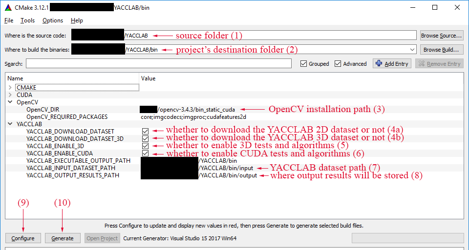
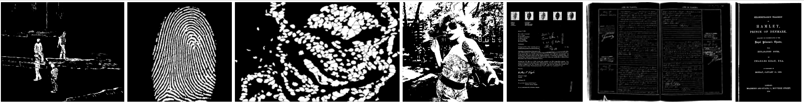
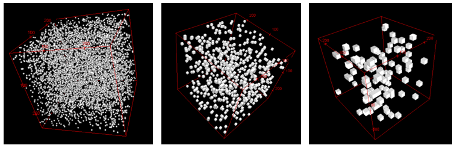
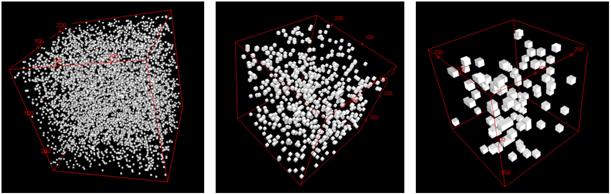
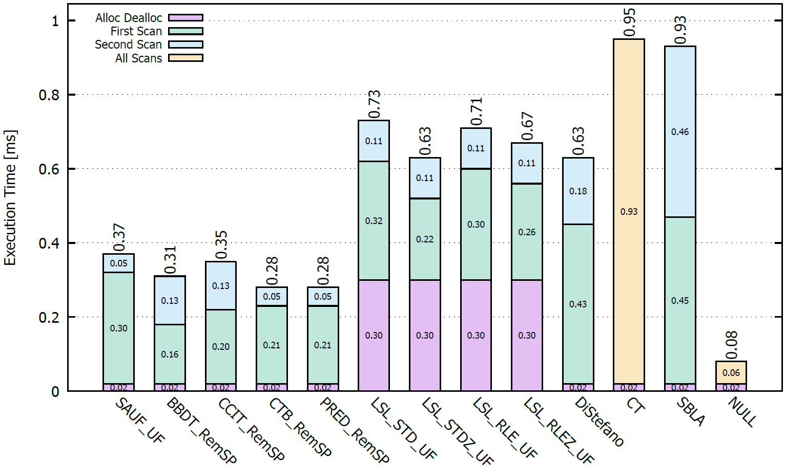
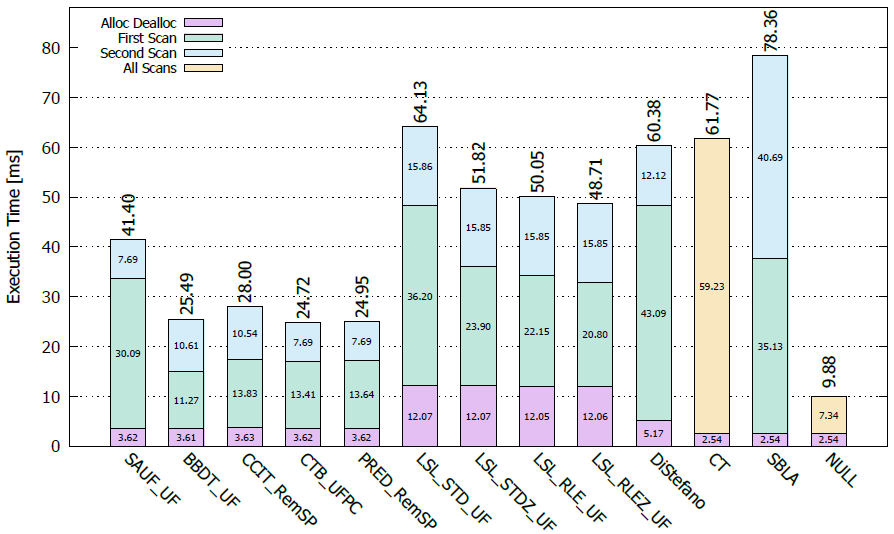

# Yet Another Connected Components Labeling Benchmark
[](https://github.com/prittt/YACCLAB/releases/latest/)
[](https://github.com/prittt/YACCLAB/blob/master/LICENSE)<!-- ALL-CONTRIBUTORS-BADGE:START - Do not remove or modify this section -->
[](#contributors)
<!-- ALL-CONTRIBUTORS-BADGE:END -->

<table>
<thead>
<tr>
    <th>OS</th>
    <th>Build</th>
    <th>Compiler</th>
    <th>OpenCV</th>
    <th>CMake</th>
    <th>GPU</th>
    <th width="200px">Travis CI</th>
    <th width="200px">GitHub Actions</th>
    <th width="200px">Jenkins</th>
</tr>
<thead>
<tbody>
<tr>
    <td align="center">Ubuntu<br/>16.04.6 LTS</td>
    <td align="center">x64</td>
    <td align="center">gcc 5.4.0</td>
    <td align="center">3.1.0</td>
    <td align="center">3.13</td>
    <td align="center">None</td>
    <td align="center"><a href="https://travis-ci.org/prittt/YACCLAB"></a></td>
    <td align="center">N/A</td>
    <td align="center">N/A</td>
</tr>
<tr>
    <td align="center">MacOS<br/>(Darwin 17.7.0)</td>
    <td align="center">x64</td>
    <td align="center">AppleClang 10<br/>(Xcode-10.1)</td>
    <td align="center">3.1.0</td>
    <td align="center">3.13</td>
    <td align="center">None</td>
    <td align="center"><a href="https://travis-ci.org/prittt/YACCLAB"></a></td>
    <td align="center">N/A</td>
    <td align="center">N/A</td>
</tr>
<tr>
    <td align="center">Ubuntu<br/>18.04.6 LTS</td>
    <td align="center">x64</td>
    <td align="center">gcc 7</td>
    <td align="center">4.1.2</td>
    <td align="center">3.13.5</td>
    <td align="center">None</td>
    <td align="center">N/A</td>
    <td align="center"><a href="https://github.com/prittt/YACCLAB/actions"></a></td>
    <td align="center">N/A</td>
</tr>
<tr>
    <td align="center">Ubuntu<br/>16.04.6 LTS</td>
    <td align="center">x64</td>
    <td align="center">gcc 5.4.0</td>
    <td align="center">4.4</td>
    <td align="center">3.10.3</td>
    <td align="center">2080Ti, CUDA 9.2</td>
    <td align="center">N/A</td>
    <td align="center">N/A</td>
    <td align="center"><a href="https://jenkins-master-deephealth-unix01.ing.unimore.it/job/YACCLAB/job/master/"></a></td>
</tr>
</tbody>
</table>

<p align="justify">Please include the following references when citing the YACCLAB project/dataset:</p>

- <p align="justify"> Allegretti, Stefano; Bolelli, Federico; Grana, Costantino "Optimized Block-Based Algorithms to Label Connected Components on GPUs." IEEE Transactions on Parallel and Distributed Systems, 2019. <a title="BibTex" href="https://prittt.github.io/pub_files/2019tpds.html">BibTex</a>. <a title="Download" href="https://prittt.github.io/pub_files/2019tpds.pdf">PDF</a>.</p>

- <p align="justify"> Bolelli, Federico; Cancilla, Michele; Baraldi, Lorenzo; Grana, Costantino "Towards Reliable Experiments on the Performance of Connected Components Labeling Algorithms" Journal of Real-Time Image Processing, 2018. <a title="BibTex" href="https://prittt.github.io/pub_files/2018jrtip.html">BibTex</a>. <a title="Download" href="https://prittt.github.io/pub_files/2018jrtip.pdf">PDF</a>.</p>

- <p align="justify"> Grana, Costantino; Bolelli, Federico; Baraldi, Lorenzo; Vezzani, Roberto "YACCLAB - Yet Another Connected Components Labeling Benchmark" Proceedings of the 23rd International Conference on Pattern Recognition, Cancun, Mexico, 4-8 Dec 2016. <a title="BibTex" href="https://prittt.github.io/pub_files/2016icpr.html">BibTex</a>. <a title="Download" href="https://prittt.github.io/pub_files/2016icpr.pdf">PDF</a>.</p>

<p align="justify">
YACCLAB is an open source <i>C++</i> project that enables researchers to test CCL algorithms under extremely variable points of view, running and testing algorithms on a collection of datasets described below. The benchmark performs the following tests which will be described later in this readme: <i>correctness</i>, average run-time (<i>average</i>), average run-time with steps (<i>average_ws</i>), <i>density</i>, <i>size</i>, <i>granularity</i> and memory accesses (<i>memory</i>).

Notice that 8-connectivity is always used in the project.
</p>

## Requirements

<p align="justify">
To correctly install and run YACCLAB following packages, libraries and utility are needed:

- CMake 3.13 or higher (https://cmake.org);
- OpenCV 3.0 or higher (http://opencv.org), required packages are `core`, `imgcodecs`, `imgproc`;
- Gnuplot (http://www.gnuplot.info/);
- One of your favourite IDE/compiler with C++14 support.

GPU algorithms also require:
- CUDA Toolkit 9.2 or higher (https://developer.nvidia.com/cuda-toolkit) and OpenCV `cudafeatures2d` package.

Notes for gnuplot:
- on Windows system: be sure add gnuplot to system path if you want YACCLAB automatically generates charts.
- on MacOS system: 'pdf terminal' seems to be not available due to old version of cairo, 'postscript' is used instead.

</p>

## Installation (refer to the image below)

- <p align="justify">Clone the GitHub repository (HTTPS clone URL: https://github.com/prittt/YACCLAB.git) or simply download the full master branch zip file and extract it (e.g YACCLAB folder).</p>
- <p align="justify">Install software in YACCLAB/bin subfolder (suggested) or wherever you want using CMake (point 2 of the example image). Note that CMake should automatically find the OpenCV path whether correctly installed on your OS (3), download the YACCLAB Dataset (be sure to check the box if you want to download it (4a) and (4b) or to select the correct path if the dataset is already on your file system (7)), and create a C++ project for the selected IDE/compiler (9-10). Moreover, if you want to test 3D or GPU algorithms tick the corresponding boxes (5) and (6). </p>



- <p align="justify">Set the <a href="#conf">configuration file (config.yaml)</a> placed in the installation folder (bin in this example) in order to select desired tests.</p>

- <p align="justify">Open the project, compile and run it: the work is done!</p>

### CMake Configuration Variables

| Name                                 | Meaning                     | Default | 
| ------------------------------------ |-----------------------------| --------|
| `YACCLAB_DOWNLOAD_DATASET`           | whether to automatically download the 2D YACCLAB dataset or not  | `OFF` |
| `YACCLAB_DOWNLOAD_DATASET_3D`        | whether to automatically download the 3D YACCLAB dataset or not  | `OFF` |
| `YACCLAB_ENABLE_3D`                  | enable/disable the support for 3D algorithms | `OFF` |
| `YACCLAB_ENABLE_CUDA`                | enable/disable CUDA support | `OFF`   |
| `YACCLAB_ENABLE_EPDT_19C`     | enable/disable the EPDT_19C 3D algorithm which is based on a heuristic decision tree generated from a 3D mask with 19 conditions (may noticeably increase compilation time), it has no effect when YACCLAB_ENABLE_3D is `OFF` | `OFF` |
| `YACCLAB_ENABLE_EPDT_22C`     | enable/disable the EPDT_22C 3D algorithm which is based on a heuristic decision tree generated from a 3D mask with 22 conditions (may noticeably increase compilation time), it has no effect when YACCLAB_ENABLE_3D is `OFF` | `OFF` |
| `YACCLAB_ENABLE_EPDT_26C`     | enable/disable the EPDT_26C 3D algorithm which is based on a heuristic decision tree generated from a 3D mask with 26 conditions (may noticeably increase compilation time), it has no effect when YACCLAB_ENABLE_3D is `OFF` | `OFF` |
| `YACCLAB_FORCE_CONFIG_GENERATION`     | whether to force the generation of the default configuration file (`config.yaml`) or not. When this flag is turned `OFF` any existing configuration file will not be overwritten   | `OFF` |
| `YACCLAB_INPUT_DATASET_PATH`         | path to the `input` dataset folder, where to find test datasets  | `${CMAKE_INSTALL_PREFIX}/input` |
| `YACCLAB_OUTPUT_RESULTS_PATH`        | path to the `output` folder, where to save output results  | `${CMAKE_INSTALL_PREFIX}/output` |
| `OpenCV_DIR`                         | OpenCV installation path    |  -      |

## How to include a YACCLAB algorithm into your own project?

<p align="justify">If your project requires a Connected Components Labeling algorithm and you are not interested in the whole YACCLAB benchmark you can use the <i>connectedComponent</i> function of the OpenCV library which implements the BBDT and SAUF algorithms since version 3.2.</p>
<p align="justify">Anyway, when the <i>connectedComponents</i> function is called, a lot of additional code will be executed together with the core function. If your project requires the best performance you can include an algorithm implemented in YACCLAB adding the following files to your project:</p>
<ol>
  <li><i>labeling_algorithms.h</i> and <i>labeling_algorithms.cc</i> which define the base class from which every algorithm derives from;</li>
  <li><i>label_solver.h</i> and <i>label_solver.cc</i> which cointain the implementation of labels solving algorithms;</li>
  <li><i>memory_tester.h</i> and <i>performance_evaluator.h</i> just to make things work without changing the code;</li>
  <li><i>headers</i> and <i>sources</i> files of the required algorithm/s. The association between algorithms and headers/sources files is reported in the tables below.</li>
</ol>  

### CPU Algorithms

 <table>
  <tr>
    <th>Algorithm Name</th>
    <th width="130">Authors</th>
    <th>Year</th>
    <th>Acronym</th>
    <th>Required Files</th>
    <th>Templated on Labels Solver</th>
  </tr>	
  <tr>
    <td align="center">-</td>
    <td align="center">L. Di Stefano,<br>A. Bulgarelli  <a href="#DiStefano">[3]</a></td>
    <td align="center">1999</td>
    <td align="center">DiStefano</td>
    <td align="center"><i>labeling_distefano_1999.h</i></td>
    <td align="center">NO</td>
  </tr>
  <tr>
    <td align="center">Contour Tracing</td>
    <td align="center">F. Chang,</br>C.J. Chen,</br>C.J. Lu  <a href="#CT">[1]</a></td>
    <td align="center">1999</td>
    <td align="center">CT</td>
    <td align="center"><i>labeling_fchang_2003.h</i></td>
    <td align="center">NO</td>
  </tr>
  <tr>
    <td align="center">Run-Based Two-Scan</td>
    <td align="center">L. He,</br>Y. Chao,</br>K. Suzuki  <a href="#RBTS">[30]</a></td>
    <td align="center">2008</td>
    <td align="center">RBTS</td>
    <td align="center"><i>labeling_he_2008.h</i></td>
    <td align="center">YES</td>
  </tr>
  <tr>
    <td align="center">Scan Array-based with Union Find</td>
    <td align="center">K. Wu,</br>E. Otoo,</br>K. Suzuki  <a href="#SAUF">[6]</a></td>
    <td align="center">2009</td>
    <td align="center">SAUF</td>
    <td align="center"><i>labeling_wu_2009.h</i>, <i>labeling_wu_2009_tree.inc</i></td>
    <td align="center">YES</td>
  </tr>
    <tr>
    <td align="center">Stripe-Based Labeling Algorithm</td>
    <td align="center">H.L. Zhao,</br>Y.B. Fan,</br>T.X. Zhang,</br>H.S. Sang  <a href="#SBLA">[8]</a></td>
    <td align="center">2010</td>
    <td align="center">SBLA</td>
    <td align="center"><i>labeling_zhao_2010.h</i></td>
    <td align="center">NO</td>
  </tr>
  <tr>
    <td align="center">Block-Based with Decision Tree</td>
    <td align="center">C. Grana,</br>D. Borghesani,</br>R. Cucchiara  <a href="#BBDT">[4]</a></td>
    <td align="center">2010</td>
    <td align="center">BBDT</td>
    <td align="center"><i>labeling_grana_2010.h</i>, <i>labeling_grana_2010_tree.inc</i></td>
    <td align="center">YES</td>
  </tr>
  <tr>
    <td align="center">Configuration Transition Based</td>
    <td align="center">L. He,</br>X. Zhao,</br>Y. Chao,</br>K. Suzuki  <a href="#CTB">[7]</a></td>
    <td align="center">2014</td>
    <td align="center">CTB</td>
    <td align="center"><i>labeling_he_2014.h</i>, <i>labeling_he_2014_graph.inc</i>
    <td align="center">YES</td>
  </tr>
  <tr>
    <td align="center">Block-Based with Binary Decision Trees</td>
    <td align="center">W.Y. Chang,</br>C.C. Chiu,</br>J.H. Yang  <a href="#CCIT">[2]</a></td>
    <td align="center">2015</td>
    <td align="center">CCIT</td>
    <td align="center"><i>labeling_wychang_2015.h</i>, <i>labeling_wychang_2015_tree.inc</i>, <i>labeling_wychang_2015_tree_0.inc</i></td>
    <td align="center">YES</td>
  </tr>
  <tr>
    <td align="center">Light Speed Labeling</td>
    <td align="center">L. Cabaret,</br>L. Lacassagne,</br>D. Etiemble  <a href="#LSL_STD">[5]</a></td>
    <td align="center">2016</td>
    <td align="center">LSL_STD<a href="#I"><sup>I</sup></a></br>LSL_STDZ<a href="#II"><sup>II</sup></a></br>LSL_RLE<a href="#III"><sup>III</sup></a></td>
    <td align="center"><i>labeling_lacassagne_2016.h</i>, <i>labeling_lacassagne_2016_code.inc</i></td>
    <td align="center">YES<a href="#IV"><sup>IV</sup></a></td>
  </tr>
  <tr>
    <td align="center">Pixel Prediction</td>
    <td align="center">C.Grana,</br>L. Baraldi,</br>F. Bolelli  <a href="#PRED">[9]</a></td>
    <td align="center">2016</td>
    <td align="center">PRED</td>
    <td align="center"><i>labeling_grana_2016.h</i>, <i>labeling_grana_2016_forest.inc</i>, <i>labeling_grana_2016_forest_0.inc</i>
    <td align="center">YES</td>
  </tr>
  <tr>
    <td align="center">Directed Rooted Acyclic Graph</td>
    <td align="center">F. Bolelli,</br>L. Baraldi,</br>M. Cancilla,</br>C. Grana  <a href="#DRAG">[23]</a></td>
    <td align="center">2018</td>
    <td align="center">DRAG</td>
    <td align="center"><i>labeling_bolelli_2018.h</i>, <i>labeling_grana_2018_drag.inc</i></td>
    <td align="center">YES</td>
  </tr>
  <tr>
    <td align="center">Spaghetti Labeling</td>
    <td align="center">F. Bolelli,</br>S. Allegretti,</br>L. Baraldi,</br>C. Grana <a href="#SPAGHETTI">[26]</a></td>
    <td align="center">2019</td>
    <td align="center">Spaghetti</td>
    <td align="center"><i>labeling_bolelli_2019.h</i>, <i>labeling_bolelli_2019_forest.inc</i>, <i>labeling_bolelli_2019_forest_firstline.inc</i>, <i>labeling_bolelli_2019_forest_lastline.inc</i>, <i>labeling_bolelli_2019_forest_singleline.inc</i></td>
    <td align="center">YES</td>
  </tr>
  <tr>
    <td align="center">Null Labeling</td>
    <td align="center">F. Bolelli,</br>M. Cancilla,</br>L. Baraldi,</br>C. Grana <a href="#YACCLAB_JRTIP">[13]</a></td> 
    <td align="center">-</td>
    <td align="center">NULL<a href="#V"><sup>V</sup></a></td>
    <td align="center"><i>labeling_null.h</i></td>
    <td align="center">NO</td>
  </tr>
<tr>
    <td align="center">Entropy Partitioning Decision Tree</td>
    <td align="center">M. Söchting,</br>S. Allegretti,</br>F. Bolelli,</br>C. Grana <a href="#EPDT">[31]</a></td>
    <td align="center">2021</td>
    <td align="center">EPDT_19c and EPDT_22c<a href="#VI"><sup>VI</sup></a></td>
    <td align="center"><i>labeling3D_BBDT_2019.h</i>, <i>labeling_bolelli_2019_forest.inc</i>, <i>labeling_bolelli_2019_forest_firstline.inc</i>, <i>labeling_bolelli_2019_forest_lastline.inc</i>, <i>labeling_bolelli_2019_forest_singleline.inc</i></td>
    <td align="center">YES</td>
  </tr>
</table>

<a name="I"><sup>I</sup></a> standard version. </br>
<a name="II"><sup>II</sup></a> with zero-offset optimization. </br>
<a name="III"><sup>III</sup></a> with RLE compression. </br>
<a name="IV"><sup>IV</sup></a> only on TTA and UF. </br>
<a name="V"><sup>V</sup></a> it only copies the pixels from the input image to the output one simply defining a lower bound limit for the execution time of CCL algorithms on a given machine and dataset.</br>
<a name="VI"><sup>VI</sup></a> EPDT_19c and EPDT_22c algorithms are based on very big decision trees that translate in many lines of C++ code. They may thus noticeably increase the build time. For this reason, a special flag (`YACCLAB_ENABLE_EPDT_ALGOS`) to enable/disable such algorithms is provided in the CMake file. By default the flag is OFF.

### GPU Algorithms
 <table>
  <tr>
    <th>Algorithm Name</th>
    <th width="130">Authors</th>
    <th>Year</th>
    <th>Acronym</th>
    <th>Required Files</th>
    <th>Templated on Labels Solver</th>
  </tr>	
  <tr>
    <td align="center">Union Find</td>
    <td align="center">V. Oliveira,</br>R. Lotufo <a href="#UF">[18]</a></td>
    <td align="center">2010</td>
    <td align="center">UF</td>
    <td align="center"><i>labeling_CUDA_UF.cu</i></td>
    <td align="center">NO</td>
  </tr>
  <tr>
    <td align="center">Optimized</br>Label Equivalence</td>
    <td align="center">O. Kalentev,</br>A. Rai,</br>S. Kemnitz,</br>R. Schneider <a href="#OLE">[19]</a></td>
    <td align="center">2011</td>
    <td align="center">OLE</td>
    <td align="center"><i>labeling_CUDA_OLE.cu</i></td>
    <td align="center">NO</td>
  </tr>
  <tr>
    <td align="center">Block Equivalence</td>
    <td align="center">S. Zavalishin,</br>I. Safonov,</br>Y. Bekhtin,</br>I. Kurilin <a href="#BE">[20]</a></td>
    <td align="center">2016</td>
    <td align="center">BE</td>
    <td align="center"><i>labeling_CUDA_BE.cu</i></td>
    <td align="center">NO</td>
  </tr>
  <tr>
    <td align="center">Distanceless</br>Label Propagation</td>
    <td align="center">L. Cabaret,</br>L. Lacassagne,</br>D. Etiemble <a href="#DLP">[21]</a></td>
    <td align="center">2017</td>
    <td align="center">DLP</td>
    <td align="center"><i>labeling_CUDA_DLP.cu</i></td>
    <td align="center">NO</td>
  </tr>
  <tr>
    <td align="center">CUDA SAUF</td>
    <td align="center">S. Allegretti,</br>F. Bolelli,</br>M. Cancilla,</br>C. Grana <a href="#CAIP">[29]</a></td>
    <td align="center">-</td>
    <td align="center">C-SAUF</td>
    <td align="center"><i>labeling_CUDA_SAUF.cu</i>,</br><i>labeling_wu_2009_tree.inc</i></td>
    <td align="center">NO</td>
  </tr>
  <tr>
    <td align="center">CUDA BBDT</td>
    <td align="center">S. Allegretti,</br>F. Bolelli,</br>M. Cancilla,</br>C. Grana <a href="#CAIP">[29]</a></td>
    <td align="center">-</td>
    <td align="center">C-BBDT</td>
    <td align="center"><i>labeling_CUDA_BBDT.cu</i>, <i>labeling_grana_2010_tree.inc</i></td>
    <td align="center">NO</td>
  </tr>
    <tr>
    <td align="center">CUDA DRAG</td>
    <td align="center">S. Allegretti,</br>F. Bolelli,</br>M. Cancilla,</br>C. Grana <a href="#CAIP">[29]</a></td>
    <td align="center">-</td>
    <td align="center">C-DRAG</td>
    <td align="center"><i>labeling_CUDA_DRAG.cu</i></td>
    <td align="center">NO</td>
  </tr>
  <tr>
    <td align="center">Block-based Union Find</td>
    <td align="center">S. Allegretti,</br>F. Bolelli,</br>C. Grana <a href="#BUF_BKE">[24]</a></td>
    <td align="center">2019</td>
    <td align="center">BUF</td>
    <td align="center"><i>labeling_CUDA_BUF.cu</i></td>
    <td align="center">NO</td>
  </tr>
    <tr>
    <td align="center">Block-based Komura Equivalence</td>
    <td align="center">S. Allegretti,</br>F. Bolelli,</br>C. Grana <a href="#BUF_BKE">[24]</a></td>
    <td align="center">2019</td>
    <td align="center">BKE</td>
    <td align="center"><i>labeling_CUDA_BKE.cu</i></td>
    <td align="center">NO</td>
  </tr>
</table>

### Example of Algorithm Usage Outside the Benchmark

```c++
#include "labels_solver.h"
#include "labeling_algorithms.h"
#include "labeling_grana_2010.h" // To include the algorithm code (BBDT in this example)

#include <opencv2/opencv.hpp>

using namespace cv;

int main()
{
    BBDT<UFPC> BBDT_UFPC; // To create an object of the desired algorithm (BBDT in this example)
                          // templated on the labels solving strategy. See the README for the
                          // complete list of the available labels solvers, available algorithms
                          // (N.B. non all the algorithms are templated on the solver) and their
                          // acronyms.

    BBDT_UFPC.img_ = imread("test_image.png", IMREAD_GRAYSCALE); // To load into the CCL object
                                                                 // the BINARY image to be labeled

    threshold(BBDT_UFPC.img_, BBDT_UFPC.img_, 100, 1, THRESH_BINARY); // Just to be sure that the
                                                                      // loaded image is binary

    BBDT_UFPC.PerformLabeling(); // To perform Connected Components Labeling!

    Mat1i output = BBDT_UFPC.img_labels_; // To get the output labeled image  
    unsigned n_labels = BBDT_UFPC.n_labels_; // To get the number of labels found in the input img

    return EXIT_SUCCESS;
}
```

<a name="conf"></a>
## Configuration File
<p align="justify">A <tt>YAML</tt> configuration file placed in the installation folder lets you specify which kinds of tests should be performed, on which datasets and on which algorithms.
Four categories of algorithms are supported: 2D CPU, 2D GPU, 3D CPU and 3D GPU. For each of them, the configuration parameters are reported below. </p>

- <i>execute</i> - boolean value which specifies whether the current category of algorithms will be tested: 
```yaml
execute:    true
```

- <i>perform</i> - dictionary which specifies the <a href="#conf">kind of tests</a> to perform: 
```yaml
perform:
  correctness:        false
  average:            true
  average_with_steps: false
  density:            false
  granularity:        false
  memory:             false
```

- <i>correctness_tests</i> - dictionary indicating the kind of correctness tests to perform:
```yaml
correctness_tests:
  eight_connectivity_standard: true
  eight_connectivity_steps:    true
  eight_connectivity_memory:   true
```

- <i>tests_number</i> - dictionary which sets the number of runs for each test available:
```yaml
tests_number:
  average:            10
  average_with_steps: 10
  density:            10
  granularity:        10
```

- <i>algorithms</i> - list of algorithms on which apply the chosen tests:
```yaml
algorithms:
  - SAUF_RemSP
  - SAUF_TTA
  - BBDT_RemSP
  - BBDT_UFPC
  - CT
  - labeling_NULL
```

- <i>check_datasets</i>, <i>average_datasets</i>, <i>average_ws_datasets</i> and <i>memory_datasets</i> - lists of <a href="#conf">datasets</a> on which, respectively, correctness, average, average_ws and memory tests should be run:
<!--
- <i>check_datasets:</i> list of datasets on which CCL algorithms should be checked.
- <i>average_datasets:</i> list of datasets on which average test should be run.
- <i>average_ws_datasets:</i> list of datasets on which <i>average_ws</i> test should be run.
- <i>memory_datasets:</i> list of datasets on which memory test should be run.
-->
```yaml
...
average_datasets: ["3dpes", "fingerprints", "hamlet", "medical", "mirflickr", "tobacco800", "xdocs"]
...
```

<p style=text-align: justify;>Finally, the following configuration parameters are common to all categories.</p>

- <i>paths</i> - dictionary with both input (datasets) and output (results) paths. It is automatically filled by Cmake during the creation of the project:
```yaml
paths: {input: "<datasets_path>", output: "<output_results_path>"}
```

- <i>write_n_labels</i> - whether to report the number of connected components in the output files:
```yaml
write_n_labels: false
```

- <i>color_labels</i> - whether to output a colored version of labeled images during tests:
```yaml
color_labels: {average: false, density: false}
```

- <i>save_middle_tests</i> - dictionary specifying, separately for every test, whether to save the output of single runs, or only a summary of the whole test:
```yaml
save_middle_tests: {average: false, average_with_steps: false, density: false, granularity: false}
```

## How to Extend YACCLAB with New Algorithms

<p align="justify">YACCLAB has been designed with extensibility in mind, so that new resources can be easily integrated into the project. A CCL algorithm is coded with a <tt>.h</tt> header file (placed in the <tt>include</tt> folder), a <tt>.cc</tt> source file (placed in the <tt>src</tt> folder), and optional additional files containing a tree/drag definition (placed in the <tt>include</tt> folder).</p>

The source file should be as follows:
```c++
#include "<header_file_name>.h"

REGISTER_LABELING_WITH_EQUIVALENCES_SOLVERS(<algorithm_name>);
// Replace the above line with "REGISTER_LABELING(<algorithm_name>);" if the algorithm
// is not template on the equivalence solver algorithm.
```
The header file should follows the structure below (see <tt>include/labeling_bolelli_2018.h</tt> to have a complete example):
```c++

// [...]

template <typename LabelsSolver> // Remove this line if the algorithm is not template 
                                 // on the equivalence solver algorithm
class <algorithm_bame> : public Labeling2D<CONN_8> { // the class must extend one of the labeling
                                                     // classes Labeling2D, Labeling3D, .. that
                                                     // are template on the connectivity type
                                                    
public:
    <algorithm_name>() {}

    // This member function should implement the labeling procedure reading data from the
    // input image "img_" (OpenCV Mat1b) and storing labels into the output one "img_labels_"
    // (OpenCV Mat1i)
    void PerformLabeling()
    {
      // [...]

      LabelsSolver::Alloc(UPPER_BOUND_8_CONNECTIVITY); // Memory allocation of the labels solver
      LabelsSolver::Setup(); // Labels solver initialization

      // [...]
      
      LabelsSolver::GetLabel(<label_id>) // To get label value from its index
      LabelsSolver::NewLabel(); // To create a new label

      LabelsSolver::Flatten(); // To flatten the equivalence solver array
    }

    // This member function should implement the with step version of the labeling procedure.
    // This is required to perform tests with steps.
    void PerformLabelingWithSteps()
    {

      double alloc_timing = Alloc(); // Alloc() should be a member function responsible
                                     // for memory allocation of the required data structures

      perf_.start();
      FirstScan(); // FirsScan should be a member function that implements the 
                   // first scan step of the algorithm (if it has one)
      perf_.stop();
      perf_.store(Step(StepType::FIRST_SCAN), perf_.last());

      perf_.start();
      SecondScan(); // SecondScan should be a member function that implements the 
                    // second scan step of the algorithm (if it has one)
      perf_.stop();
      perf_.store(Step(StepType::SECOND_SCAN), perf_.last());

      // If the algorithm does not have a distinct firs and second scan replace the lines
      // above with the following ones:
      // perf_.start();
      // AllScans(); // AllScans() shiuld be a member function which implements the entire
                     // algorithm but the allocation/deallocation 
      // perf_.stop();
      // perf_.store(Step(StepType::ALL_SCANS), perf_.last());

      perf_.start();
      Dealloc(); // Dealloc() shiuld be a member function responsible for memory
                 // deallocation.
      perf_.stop();
      perf_.store(Step(StepType::ALLOC_DEALLOC), perf_.last() + alloc_timing);

      // [...]
    }

    // This member function should implement the labeling procedure using the OpenCV Mat
    // wrapper (MemMat) implemented by YACCLAB 
    void PerformLabelingMem(std::vector<uint64_t>& accesses){
      // [...]
    }

}
```

When implementing a GPU algorithm only the <tt>.cu</tt> file is required. The file should be placed in the <tt>cuda/src</tt> folder.

<p align="justify">Once an algorithm has been added to YACCLAB, it is ready to be tested and compared to the others. Don't forget to update the configuration file! We look at YACCLAB as a growing effort towards better reproducibility of CCL algorithms, so implementations of new and existing labeling methods are very welcome.</p>

<a name="datasets"></a>
## The YACCLAB Dataset
<p align="justify">The YACCLAB dataset includes both synthetic and real images and it is suitable for a wide range of applications, ranging from document processing to surveillance, and features a significant variability in terms of resolution, image density, variance of density, and number of components. All images are provided in 1 bit per pixel PNG format, with 0 (black) being background and 1 (white) being foreground. The dataset will be automatically downloaded by CMake during the installation process as described in the <a href="#inst">installation</a> paragraph.</p>

### 2D Datasets

- <b>MIRflickr <a href="#MIRFLICKR">[10]</a>:</b><p align="justify"> Otsu-binarized version of the MIRflickr dataset, publicly available under a Creative Commons License. It contains 25,000 standard resolution images taken from Flickr. These images have an average resolution of 0.17 megapixels, there are few connected components (495 on average) and are generally composed of not too complex patterns, so the labeling is quite easy and fast.</p>

- <b>Hamlet:</b><p align="justify"> A set of 104 images scanned from a version of the Hamlet found on Project Gutenberg (http://www.gutenberg.org). Images have an average amount of 2.71 million of pixels to analyze and 1447 components to label, with an average foreground density of 0.0789. </p>

- <b>Tobacco800 <a href="#TOBACCO1">[11]</a>,<a href="#TOBACCO2">[12]</a>:</b><p align="justify"> A set of 1290 document images. It is a realistic database for document image analysis research as these documents were collected and scanned using a wide variety of equipment over time. Resolutions of documents in Tobacco800 vary significantly from 150 to 300 DPI and the dimensions of images range from 1200 by 1600 to 2500 by 3200 pixels. Since CCL is one of the initial preprocessing steps in most layout analysis or OCR algorithms, hamlet and tobacco800 allow to test the algorithm performance in such scenarios. </p>

- <b>3DPeS <a href="#3DPES">[14]</a>:</b> <p align="justify"> It comes from 3DPeS (3D People Surveillance Dataset), a surveillance dataset designed mainly for people re-identification in multi camera systems with non-overlapped fields of view. 3DPeS can be also exploited to test many other tasks, such as people detection, tracking, action analysis and trajectory analysis. The background models for all cameras are provided, so a very basic technique of motion segmentation has been applied to generate the foreground binary masks, i.e.,  background subtraction and fixed thresholding. The analysis of the foreground masks to remove small connected components and for nearest neighbor matching is a common application for CCL. </p>

- <b>Medical <a href="#MEDICAL">[15]</a>:</b><p align="justify"> This dataset is composed by histological images and allow us to cover this fundamental medical field. The process used for nuclei segmentation and binarization is described in  <a href="#MEDICAL">[15]</a>. The resulting dataset is a collection of 343 binary histological images with an average amount of 1.21 million of pixels to analyze and 484 components to label. </p>

- <b>Fingerprints <a href="#FINGERPRINTS">[16]</a>:</b><p align="justify"> This dataset counts 960 fingerprint images collected by using low-cost optical sensors or synthetically generated. These images were taken from the three Verification Competitions FCV2000, FCV2002 and FCV2004. In order to fit CCL application, fingerprints have been binarized using an adaptive threshold and then negated in order to have foreground pixel with value 255. Most of the original images have a resolution of 500 DPI and their dimensions range from 240 by 320 up to 640 by 480 pixels. </p>

<table>
<tr>
  <td align="center"></td>
</tr>
<tr>
  <td >Samples of the YACCLAB 2D (real) datasets.  From left to right: 3DPeS, Fingerprints, Medical, MIRflickr, Tobacco800, XDOCS, Hamlet.</td>
</tr>
</table>

- <b>Synthetic Images</b>:
	- <b>Classical <a href="#BBDT">[4]</a></b>:<p align="justify"> A set of synthetic random noise images who contain black and white random noise with 9 different foreground densities (10% up to 90%), from a low resolution of 32x32 pixels to a maximum resolution of 4096x4096 pixels, allowing to test the scalability and the effectiveness of different approaches when the number of labels gets high. For every combination of size and density, 10 images are provided for a total of 720 images. The resulting subset allows to evaluate performance both in terms of scalability on the number of pixels and on the number of labels (density). </p>
	- <b>Granularity <a href="#LSL">[5]</a> </b>:<p align="justify"> This dataset allows to test algorithms varying not only the pixels density but also their granularity <i>g</i> (<i>i.e.</i>, dimension of minimum foreground block), underlying the behaviour of different proposals when the number of provisional labels changes. All the images have a resolution of 2048x2048 and are generated with the Mersenne Twister MT19937 random number generator implemented in the <i>C++</i> standard and starting with a "seed" equal to zero. Density of the images ranges from 0% to 100% with step of 1% and for every density value 16 images with pixels blocks of <i>gxg</i> with <i>g</i> ∈ [1,16] are generated. Moreover, the procedure has been repeated 10 times for every couple of density-granularity for a total of 16160 images.</p>

<table>
<tr>
  <td align="center"></td>
</tr>
<tr>
  <td>Samples of the YACCLAB 2D granularity dataset: reported images have a foreground density of 30% and, from left to right, granularities are 1, 2, 4, 6, 8, 12, 14, 16.</td>
</tr>
</table>

### 3D Datasets

- <b>OASIS <a href="#OASIS">[27]</a></b>: <p align="justify"> This is a dataset of medical MRI data taken from the Open Access Series of Imaging Studies (OASIS) project. It consists of 373 volumes of 256 × 256 × 128 pixels, binarized with the Otsu threshold.</p> 

- <b>Mitochondria <a href="#MIT1">[28]</a></b>: <p align="justify">It is the Electron Microscopy Dataset, which contains binary sections taken from the CA1 hippocampus for a total of three volumes composed by 165 slices with a resolution of 1024 × 768 pixels.</p>

- <b>Hilbert <a href="#TPDS">[24]</a></b>: <p align="justify">This dataset contains six volumes of 128 × 128 × 128 pixels, filled with the 3D Hilbert curve obtained at different iterations (1 to 6) of the construction method. The Hilbert curve is a fractal space-filling curve that representsa challenging test case for the labeling algorithms.</p>

<table>
<tr>
  <td align="center"></td>
</tr>
<tr>
  <td>Samples of the YACCLAB 3D datasets. From left to right: Hilbertspace-filling curve, OASIS and Mitochondria medical imaging data.</td>
</tr>
</table>

- <b>Granularity <a href="#TPDS">[24]</a></b>: <p align="justify">It contains 3D synthetic images generated as described for the 2D version. In this case, images have a resolution of 256 x 256 x 256 pixels and only three different images for every couple of density-granularity have been generated.</p>

<table>
<tr>
  <td align="center"></td>
</tr>
<tr>
  <td>Samples of the YACCLAB 3D granularity dataset: reported images have a foreground density of 2% and, from left to right, granularities are 4, 8, 16.</td>
</tr>
</table>

<a name="tests"></a>
## Available Tests

- <b>Average run-time tests:</b> <p align="justify"> execute an algorithm on every image of a dataset. The process can be repeated more times in a single test, to get the minimum execution time for each image: this allows to get more reproducible results and overlook delays produced by other running processes. It is also possible to compare the execution speed of different algorithms on the same dataset: in this case, selected algorithms (see <a href="#conf">Configuration File</a> for more details) are executed sequentially on every image of the dataset. Results are presented in three different formats: a plain text file, histogram charts (.pdf/.ps), either in color or in gray-scale, and a LaTeX table, which can be directly included in research papers.</p>

- <b>Average run-time tests with steps:</b> <p align="justify"> evaluates the performance of an algorithm separating the allocation/deallocation time from the time required to compute labeling. Moreover, if an algorithm employs multiple scans to produce the correct output labels, YACCLAB will store the time of every scan and will display them separately. To understand how YACCLAB computes the memory allocation time for an algorithm on a reference image, it is important to underline the subtleties involved in the allocation process. Indeed, all modern operating systems (not real-time, nor embedded ones, but certainly Windows and Unix) handle virtual memory exploiting a demand paging technique, <i>i.e</i> demand paging with no pre-paging for most of Unix OS and cluster demand paging for Windows OS. This means that a disk page is copied into physical memory only when it is accessed by a process the first time, and not when the allocation function is called. Therefore, it is not possible to calculate the exact allocation time required by an algorithm, which computes CCL on a reference image, but its upper bound can be estimated using the following approach:</p>

  - forcing the allocation of the entire memory by reserving it (<tt>malloc</tt>), filling it with zeros (<tt>memset</tt>), and tracing the time;  
  - calculating the time required by the assignment operation (<tt>memset</tt>), and subtracting it from the one obtained at the previous step;
  - repeating the previous points for all data structures needed by an algorithm and summing times together.

  <p align="justify">This will produce an upper bound of the allocation time because caches may reduce the second assignment operation, increasing the estimated allocation time. Moreover, in real cases, CCL algorithms may reserve more memory than they really need, but the <tt>demand paging</tt>, differently from our measuring system, will allocate only the accessed pages.</p>

- <b>Density and size tests:</b> <p align="justify"> check the performance of different CCL algorithms when they are executed on images with varying foreground density and size. To this aim, a list of algorithms selected by the user is run sequentially on every image of the test_random dataset. As for run-time tests, it is possible to repeat this test for more than one run. The output is presented as both plain text and charts(.pdf/.ps). For a density test, the mean execution time of each algorithm is reported for densities ranging from 10% up to 90%, while for a size test the same is reported for resolutions ranging from 32 x 32 up to 4096 x 4096.</p>

- <b>Memory tests:</b> <p align="justify"> are useful to understand the reason for the good performances of an algorithm or in general to explain its behavior. Memory tests compute the average number of accesses to the label image (i.e the image used to store the provisional and then the final labels for the connected components), the average number of accesses to the binary image to be labeled, and, finally, the average number of accesses to data structures used to solve the equivalences between label classes. Moreover, if an algorithm requires extra data, memory tests summarize them as ``other'' accesses and return the average. Furthermore, all average contributions of an algorithm and dataset are summed together in order to show the total amount of memory accesses. Since counting the number of memory accesses imposes additional computations, functions implementing memory access tests are different from those implementing run-time and density tests, to keep run-time tests as objective as possible.</p>

- <b>Granularity tests:</b> <p align="justify"> evaluates an algorithm varying density (from 1% to 100%, using a 1% step) and pixels granularity, but not images resolution. The output results display the average execution time over images with the same density and granularity.</p>

## Examples of YACCLAB Output Results

<table>
  <tr>
    <td align="center"></td>
    <td align="center"></td>
  </tr>
  <tr>
    <td align="center">Fingerprints</td>
    <td align="center">XDOCS</td>
  </tr>
</table>

## Contributors

Thanks goes to these wonderful people ([emoji key](https://allcontributors.org/docs/en/emoji-key)):
<!-- ALL-CONTRIBUTORS-LIST:START - Do not remove or modify this section -->
<!-- prettier-ignore-start -->
<!-- markdownlint-disable -->
<table>
  <tr>
    <td align="center"><a href="http://www.federicobolelli.it"><br /><sub><b>Federico Bolelli</b></sub></a><br /><a href="https://github.com/prittt/YACCLAB/commits?author=prittt" title="Code">💻</a> <a href="#projectManagement-prittt" title="Project Management">📆</a> <a href="#maintenance-prittt" title="Maintenance">🚧</a> <a href="#infra-prittt" title="Infrastructure (Hosting, Build-Tools, etc)">🚇</a> <a href="#ideas-prittt" title="Ideas, Planning, & Feedback">🤔</a></td>
    <td align="center"><a href="https://github.com/stal12"><br /><sub><b>Stefano Allegretti</b></sub></a><br /><a href="https://github.com/prittt/YACCLAB/commits?author=stal12" title="Code">💻</a> <a href="#maintenance-stal12" title="Maintenance">🚧</a> <a href="https://github.com/prittt/YACCLAB/issues?q=author%3Astal12" title="Bug reports">🐛</a> <a href="#ideas-stal12" title="Ideas, Planning, & Feedback">🤔</a> <a href="#infra-stal12" title="Infrastructure (Hosting, Build-Tools, etc)">🚇</a></td>
    <td align="center"><a href="https://github.com/CostantinoGrana"><br /><sub><b>Costantino Grana</b></sub></a><br /><a href="https://github.com/prittt/YACCLAB/commits?author=CostantinoGrana" title="Code">💻</a> <a href="#projectManagement-CostantinoGrana" title="Project Management">📆</a> <a href="#ideas-CostantinoGrana" title="Ideas, Planning, & Feedback">🤔</a> <a href="#infra-CostantinoGrana" title="Infrastructure (Hosting, Build-Tools, etc)">🚇</a></td>
    <td align="center"><a href="https://michelecancilla.github.io"><br /><sub><b>Michele Cancilla</b></sub></a><br /><a href="https://github.com/prittt/YACCLAB/commits?author=MicheleCancilla" title="Code">💻</a> <a href="#platform-MicheleCancilla" title="Packaging/porting to new platform">📦</a> <a href="#maintenance-MicheleCancilla" title="Maintenance">🚧</a></td>
    <td align="center"><a href="http://www.lorenzobaraldi.com"><br /><sub><b>Lorenzo Baraldi</b></sub></a><br /><a href="https://github.com/prittt/YACCLAB/commits?author=baraldilorenzo" title="Code">💻</a> <a href="#platform-baraldilorenzo" title="Packaging/porting to new platform">📦</a></td>
  </tr>
</table>

<!-- markdownlint-enable -->
<!-- prettier-ignore-end -->
<!-- ALL-CONTRIBUTORS-LIST:END -->

This project follows the [all-contributors](https://github.com/all-contributors/all-contributors) specification. Contributions of any kind welcome


## References

<table style="border:0;">
<tr>
    <td style="vertical-align: top !important;" align="right">
      <a name="CT">[1]</a>
    </td>
    <td>
      <p align="justify">F. Chang, C.-J. Chen, and C.-J. Lu, “A linear-time component-labeling algorithm using contour tracing technique,” Computer Vision and Image Understanding, vol. 93, no. 2, pp. 206–220, 2004.</p>
    </td>
</tr>
<tr>
    <td style="vertical-align: top !important;" align="right">
      <a name="CCIT">[2]</a>
    </td>
    <td>
      <p align="justify">W.-Y.  Chang,  C.-C.  Chiu,  and  J.-H.  Yang,  “Block-based  connected-component  labeling  algorithm  using  binary  decision  trees,” Sensors, vol. 15, no. 9, pp. 23 763–23 787, 2015.</p>
    </td>
</tr>
<tr>
    <td style="vertical-align: top !important;" align="right">
        <a name="DiStefano">[3]</a>
    </td>
    <td>
      <p align="justify"> L.  Di  Stefano  and  A.  Bulgarelli,  “A  Simple  and  Efficient  Connected Components Labeling Algorithm,” in International Conference on Image Analysis and Processing. IEEE, 1999, pp. 322–327.</p>
    </td>
</tr>
<tr>
    <td style="vertical-align: top !important;" align="right">
      <a name="BBDT">[4]</a>
    </td>
    <td>
      <p align="justify">C.  Grana,  D.  Borghesani,  and  R.  Cucchiara,  “Optimized  Block-based Connected Components Labeling with Decision Trees,” IEEE Transac-tions on Image Processing, vol. 19, no. 6, pp. 1596–1609, 2010.</p>
    </td>
</tr>
<tr>
    <td style="vertical-align: top !important;" align="right">
      <a name="LSL_STD">[5]</a>
    </td>
    <td>
      <p align="justify">L. Lacassagne and B. Zavidovique, “Light speed labeling: efficient connected component labeling on risc architectures,” Journal of Real-Time Image Processing, vol. 6, no. 2, pp. 117–135, 2011.</p>
    </td>
</tr>
<tr>
    <td style="vertical-align: top !important;" align="right">
      <a name="SAUF">[6]</a>
    </td>
    <td>
      <p align="justify"> K. Wu, E. Otoo, and K. Suzuki, "Optimizing two-pass connected-component labeling algorithms,” Pattern Analysis and Applications," vol. 12, no. 2, pp. 117–135, 2009.</p>
    </td>
</tr>
<tr>
    <td style="vertical-align: top !important;" align="right">
      <a name="CTB">[7]</a>
    </td>
    <td>
      <p align="justify">L.  He,  X.  Zhao,  Y.  Chao,  and  K.  Suzuki, "Configuration-Transition-Based Connected-Component Labeling", IEEE  Transactions  on  Image Processing, vol. 23, no. 2, pp. 943–951, 2014.</p>
    </td>
</tr>
<tr>
    <td style="vertical-align: top !important;" align="right">
      <a name="SBLA">[8]</a>
    </td>
    <td>
      <p align="justify">H.  Zhao,  Y.  Fan,  T.  Zhang,  and  H.  Sang, "Stripe-based  connected components labelling," Electronics  letters,  vol.  46,  no.  21,  pp.  1434–1436, 2010.</p>
    </td>
</tr>
<tr>
    <td style="vertical-align: top !important;" align="right">
      <a name="PRED">[9]</a>
    </td>
    <td>
      <p align="justify">C. Grana, L. Baraldi, and F. Bolelli, "Optimized Connected Components Labeling  with  Pixel  Prediction," in Advanced  Concepts  for  Intelligent Vision Systems, 2016.</p>
    </td>
</tr>
<tr>
    <td style="vertical-align: top !important;" align="right">
      <a name="MIRFLICKR">[10]</a>
    </td>
    <td>
      <p align="justify">M. J. Huiskes and M. S. Lew, “The MIR Flickr Retrieval Evaluation,” in MIR ’08: Proceedings of the 2008 ACM International Conference on Multimedia Information Retrieval. New York, NY, USA: ACM, 2008.</p>
    </td>
</tr>
<tr>
    <td style="vertical-align: top !important;" align="right">
      <a name="TOBACCO1">[11]</a>
    </td>
    <td>
      <p align="justify">G. Agam, S. Argamon, O. Frieder, D. Grossman, and D. Lewis, “The Complex Document Image Processing (CDIP) Test Collection Project,” Illinois Institute of Technology, 2006.</p>
    </td>
</tr>
<tr>
    <td style="vertical-align: top !important;" align="right">
      <a name="TOBACCO2">[12]</a>
    </td>
    <td>
      <p align="justify"> D. Lewis, G. Agam, S. Argamon, O. Frieder, D. Grossman, and J. Heard, “Building a test collection for complex document information processing,” in Proceedings of the 29th annual international ACM SIGIR conference on Research and development in information retrieval. ACM, 2006, pp. 665–666.</p>
    </td>
</tr>
<tr>
    <td style="vertical-align: top !important;" align="right">
      <a name="YACCLAB_JRTIP">[13]</a>
    </td>
    <td>
      <p align="justify">F. Bolelli, M. Cancilla, L. Baraldi, C. Grana, "Towards Reliable Experiments on the Performance of Connected Components Labeling Algorithms," Journal of Real-Time Image Processing, 2018.</p>
    </td>
</tr>
<tr>
    <td style="vertical-align: top !important;" align="right">
      <a name="3DPES">[14]</a>
    </td>
    <td>
      <p align="justify">D. Baltieri, R. Vezzani, and R. Cucchiara, “3DPeS: 3D People Dataset for Surveillance and Forensics,” in Proceedings of the 2011 joint ACM workshop on Human gesture and behavior understanding. ACM, 2011, pp. 59–64.</p>
    </td>
</tr>
<tr>
    <td style="vertical-align: top !important;" align="right">
      <a name="MEDICAL">[15]</a>
    </td>
    <td>
      <p align="justify">F. Dong, H. Irshad, E.-Y. Oh, M. F. Lerwill, E. F. Brachtel, N. C. Jones, N. W. Knoblauch, L. Montaser-Kouhsari, N. B. Johnson, L. K. Rao et al., “Computational Pathology to Discriminate Benign from Malignant Intraductal Proliferations of the Breast,” PloS one, vol. 9, no. 12, p. e114885, 2014.</p>
    </td>
</tr>
<tr>
    <td style="vertical-align: top !important;" align="right">
      <a name="FINGERPRINTS">[16]</a>
    </td>
    <td>
      <p align="justify">D. Maltoni, D. Maio, A. Jain, and S. Prabhakar, "Handbook of fingerprint recognition", Springer Science & Business Media, 2009.</p>
    </td>
</tr>
<tr>
    <td style="vertical-align: top !important;" align="right">
      <a name="YACCLAB">[17]</a>
    </td>
    <td>
      <p align="justify">C.Grana, F.Bolelli, L.Baraldi, and R.Vezzani, "YACCLAB - Yet Another Connected Components Labeling Benchmark," Proceedings of the 23rd International Conference on Pattern Recognition, Cancun, Mexico, 4-8 Dec 2016, 2016.</p>
    </td>
</tr>
<tr>
    <td style="vertical-align: top !important;" align="right">
      <a name="UF">[18]</a>
    </td>
    <td>
      <p align="justify">V. Oliveira and R. Lotufo, "A study on connected components labeling algorithms using GPUs," in SIBGRAPI. vol. 3, p. 4, 2010.</p>
    </td>
</tr>
<tr>
    <td style="vertical-align: top !important;" align="right">
      <a name="OLE">[19]</a>
    </td>
    <td> 
      <p align="justify">O. Kalentev, A. Rai, S. Kemnitz, R. Schneider," Connected component labeling on a 2D grid using CUDA," in Journal of Parallel and Distributed Computing 71(4), 615–620, 2011.</p>
    </td>
</tr>
<tr>
    <td style="vertical-align: top !important;" align="right">
      <a name="BE">[20]</a>
    </td>
    <td>
      <p align="justify">S. Zavalishin, I. Safonov, Y. Bekhtin, I. Kurilin, "Block Equivalence Algorithm for Labeling 2D and 3D Images on GPU," in Electronic Imaging 2016(2), 1–7, 2016.</p>
    </td>
</tr>
<tr>
    <td style="vertical-align: top !important;" align="right">
      <a name="DLP">[21]</a>
    </td>
    <td>
      <p align="justify">L. Cabaret, L. Lacassagne, D. Etiemble, "Distanceless Label Propagation: an Efficient Direct Connected Component Labeling Algorithm for GPUs," in Seventh International Conference on Image Processing Theory, Tools and Applications, IPTA, 2017.</p>
    </td>
</tr>
<tr>
    <td style="vertical-align: top !important;" align="right">
      <a name="KE">[22]</a>
    </td>
    <td>
      <p align="justify">S. Allegretti, F. Bolelli, M. Cancilla, C. Grana, "Optimizing GPU-Based Connected Components Labeling Algorithms," in Third IEEE International Conference on Image Processing, Applications and Systems, IPAS, 2018.</p>
    </td>
</tr>
<tr>
    <td style="vertical-align: top !important;" align="right">
      <a name="DRAG">[23]</a>
    </td>
    <td>
      <p align="justify">F. Bolelli, L. Baraldi, M. Cancilla, C. Grana, "Connected Components Labeling on DRAGs," in International Conference on Pattern Recognition, 2018.</p>
    </td>
</tr>
<tr>
    <td style="vertical-align: top !important;" align="right">
      <a name="BUF_BKE">[24]</a>
    </td>
    <td>
      <p align="justify">S. Allegretti, F. Bolelli, C. Grana, "Optimized Block-Based Algorithms to Label Connected Components on GPUs," in IEEE Transactions on Parallel and Distributed Systems, 2019.</p>
    </td>
</tr>
<tr>
    <td style="vertical-align: top !important;" align="right">
      <a name="SPAGHETTI">[26]</a>
    </td>
    <td>
      <p align="justify">F. Bolelli, S. Allegretti, L. Baraldi, C. Grana, "Spaghetti Labeling: Directed Acyclic Graphs for Block-Based Connected Components Labeling," IEEE Transactions on Image Processing, 2019.</p>
    </td>
</tr>
<tr>
    <td style="vertical-align: top !important;" align="right">
      <a name="OASIS">[27]</a>
    </td>
    <td>
      <p align="justify">D. S. Marcus, A. F. Fotenos, J. G. Csernansky, J. C. Morris, R. L. Buckner, “Open Access Series of Imaging Studies (OASIS): Longitudinal MRI Data in  Nondemented and Demented OlderAdults,” J. Cognitive Neurosci., vol. 22, no. 12, pp. 2677–2684, 2010.</p>
    </td>
</tr>
<tr>
    <td style="vertical-align: top !important;" align="right">
      <a name="MIT1">[28]</a>
    </td>
    <td>
      <p align="justify">A. Lucchi, Y. Li, and P. Fua, “Learning for Structured Prediction Using Approximate Subgradient Descent with Working Sets,” in Proceedings of the IEEE Conference  on Computer Vision and Pattern Recognition, 2013, pp. 1987–1994.</p>
    </td>
</tr>
<tr>
    <td style="vertical-align: top !important;" align="right">
      <a name="CAIP">[29]</a>
    </td>
    <td>
      <p align="justify">S. Allegretti, F, Bolelli, M. Cancilla, F. Pollastri, L. Canalini, C. Grana, "How does Connected Components Labeling with Decision Trees perform on GPUs?," In 18th International Conference on Computer Analysis of Images and Patterns, 2019.</p>
    </td>
</tr>
<tr>
    <td style="vertical-align: top !important;" align="right">
      <a name="RBTS">[30]</a>
    </td>
    <td>
      <p align="justify">
	L. He,  Y. Chao, K. Suzuki. "A run-based two-scan labeling algorithm." IEEE Transactions on Image Processing, 2008.</p>
    </td>
</tr>	
<tr>
    <td style="vertical-align: top !important;" align="right">
      <a name="EPDT">[31]</a>
    </td>
    <td>
      <p align="justify">
	M. Söchting, S. Allegretti, F. Bolelli, C. Grana. "A Heuristic-Based Decision Tree for Connected Components Labeling of 3D Volumes." 25th International Conference on Pattern Recognition, 2021</p>
    </td>
</tr>	
</table>
